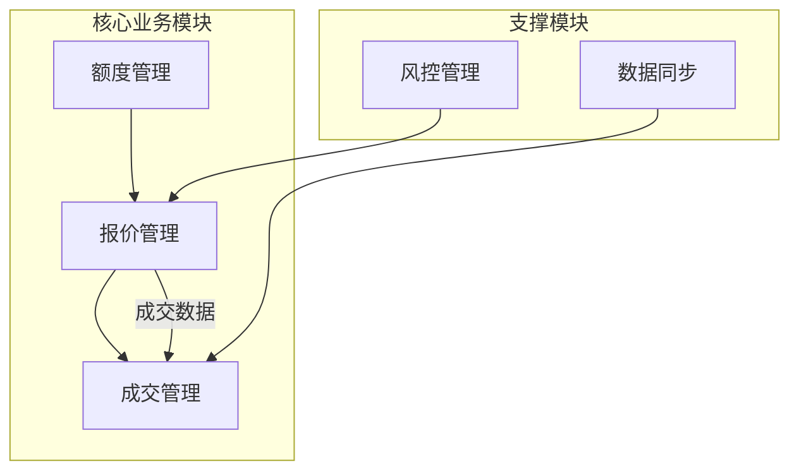
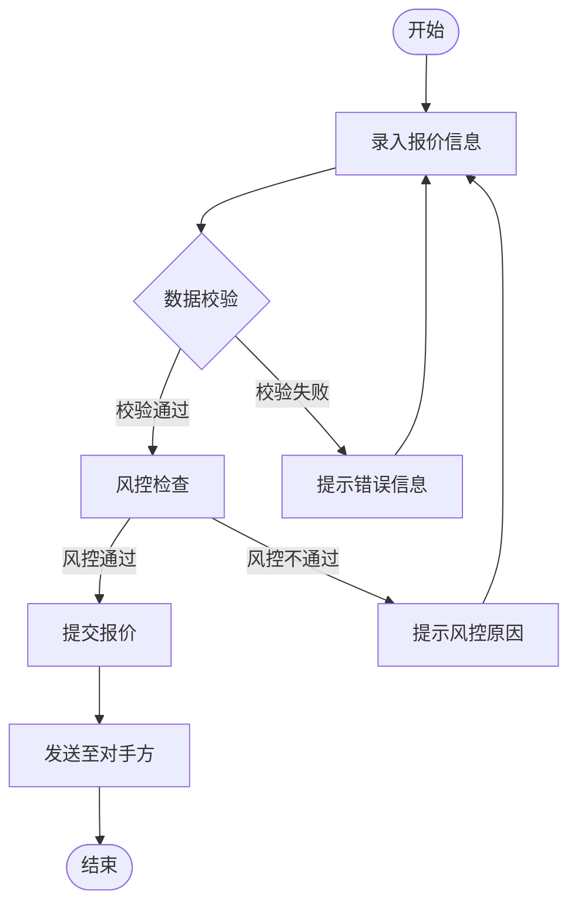
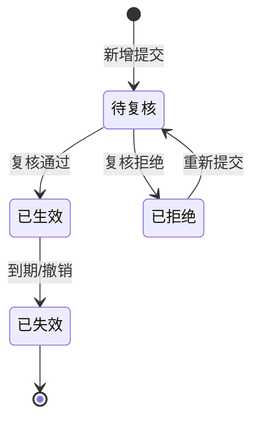
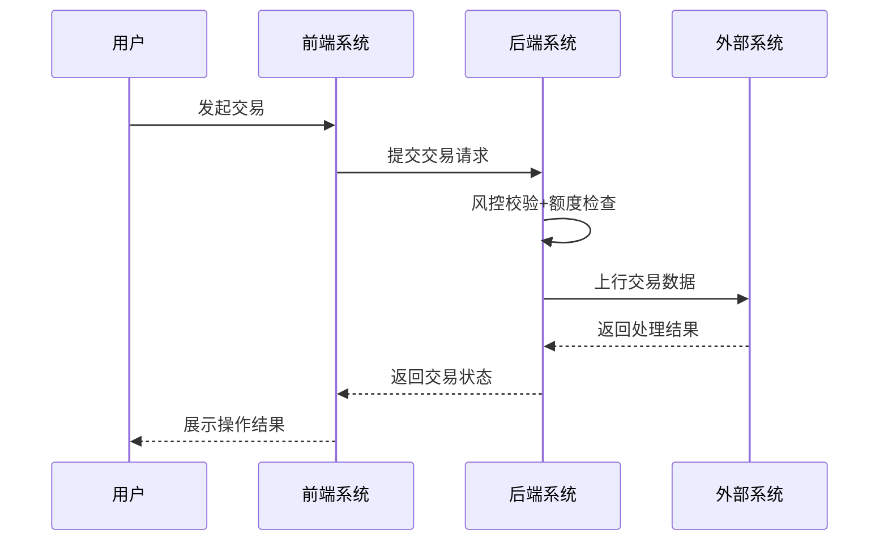
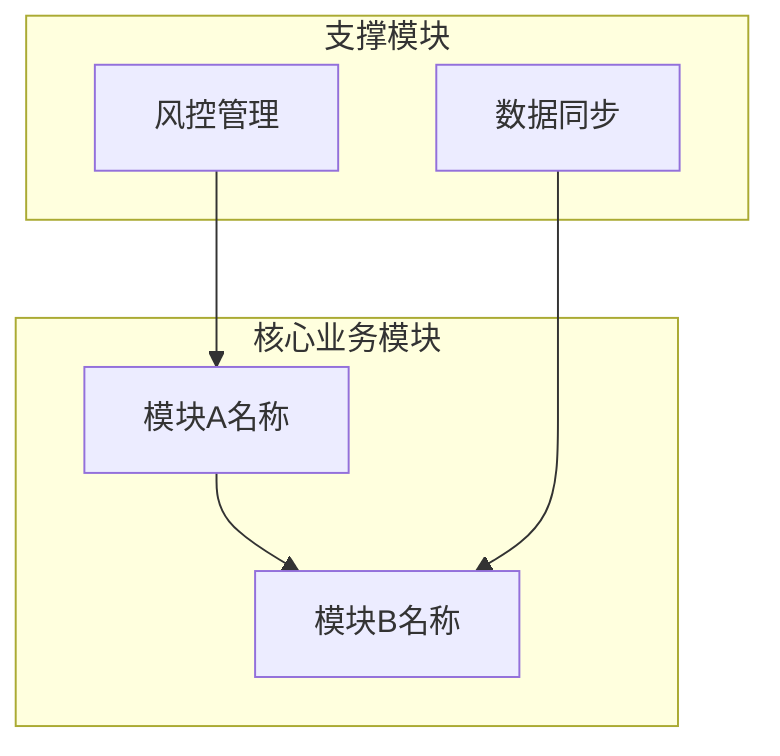
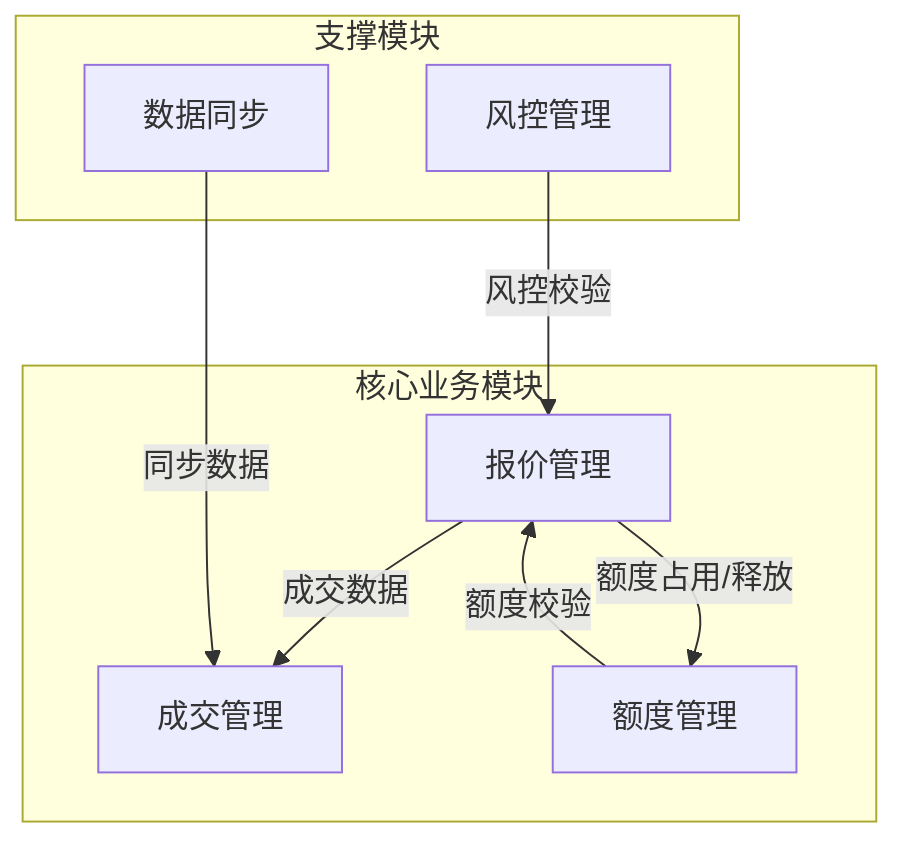
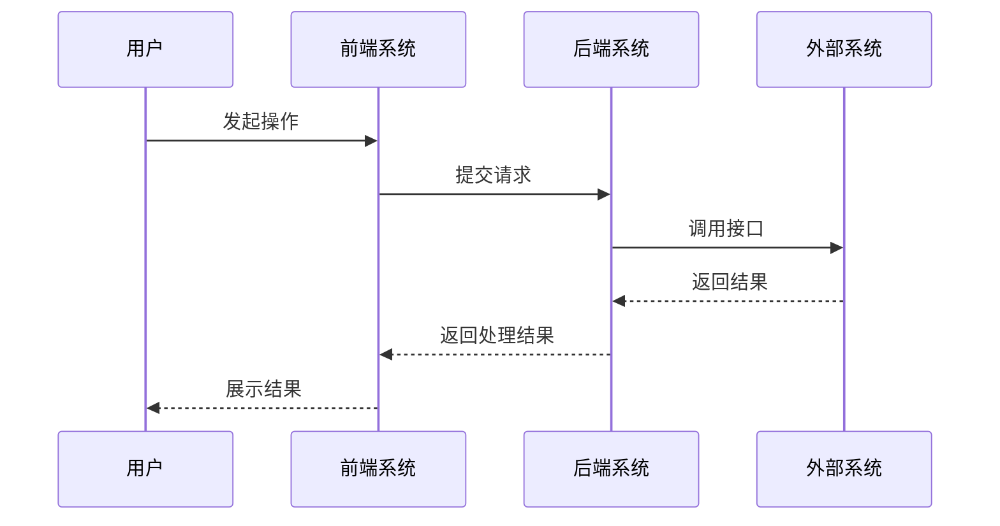

# 金融交易系统需求规格说明书标准化撰写（全模块细粒度+固定版式）

## 技能描述

严格遵循企业金融交易系统需求规格说明书**固定版式、单独页签要求、模块撰写规范**，基于用户核心需求**自动拆解至增删改查/导入导出等细粒度功能点**，每个功能点强制包含功能说明、业务规则、界面展示、输入项、输出项五大核心板块；同时按要求生成独立封面、独立目录、独立版本历史页，文档框架完整、版式统一、内容可落地，可直接指导开发、测试与项目落地。

## 适用场景

企业金融交易类系统（交易管理、风控管理、复核管理、额度管理、定价管理等）全模块需求规格说明书撰写、修订、补充；金融同业类系统新模块需求设计与标准化文档输出；需严格遵循企业固定版式的各类系统需求文档编写。

## 前置要求

1. 明确待撰写系统/模块的核心业务领域（如信用拆借、质押式回购、对手方授信额度管理等）；
2. 提供模块核心业务目标/核心诉求（如「实现信用拆借全流程交易管理」「完成对手方定价的增删改查与风控校验」）；
3. 确定文档基础元数据（版本号、编写人、完成日期、文件状态、企业/系统名称）。

---

## 核心规范：固定版式+单独页签要求（强制执行，不可省略）

文档整体按**「独立封面页→独立版本历史页→独立目录页→正文内容页」**顺序排版，**每个部分单独成页，无合并、无删减**，版式与内容框架完全匹配企业模板要求。

---

### 一、独立封面页（单独成页，固定版式）

#### 1. 核心内容（按以下顺序居中排列，无其他多余内容）

- **企业名称**（如：XX金融/XX银行）
- **系统名+项目名**（如：FICC交易服务系统之货币交易下单功能建设项目）
- **文档类型**（居中加粗，大号字体）：需求规格说明书
- **模块副标题**（如：交易管理-信用拆借/风控管理-对手方额度管理）

#### 2. 页脚/底部固定信息（居右排列）

- 编制单位：XXX部门/XXX公司
- 编制人：XXX、XXX
- 完成日期：YYYY年MM月DD日

#### 3. 格式要求

| 内容 | 字体 | 字号 | 样式 | 对齐 |
|------|------|------|------|------|
| 主标题（系统+项目名） | 宋体 | 一号 | 加粗 | 居中 |
| 文档类型 | 宋体 | 小初 | 加粗 | 居中，与主标题隔1-2行 |
| 其他文字 | 宋体 | 小四/三号 | - | 按层级区分，整体排版整洁 |

---

### 二、独立版本历史页（单独成页，固定格式）

#### 1. 页面标题

- 居中加粗：**版 本 历 史**（宋体、三号），单独成行，无其他前缀/后缀。

#### 2. 核心内容

- 唯一呈现形式：**标准无边框表格**，占满页面主体区域
- 表格列名**固定为「版本、作者、说明、起止日期」**，无新增、无删减

| 列名 | 填写规范 |
|------|----------|
| 版本 | 按1.0、1.1、1.2……依次递增，与头部标识栏「当前版本」一致 |
| 作者 | 填写对应版本的编写/修订人，多人用顿号分隔 |
| 说明 | **精准明确修改的具体细粒度功能点+核心内容**（如：2.1.1.1.4 新增拆借连续保存功能、3.1.2.3 新增额度录入备注字段） |
| 起止日期 | 格式固定为**YYYY/MM/DD**，单次修改填单日期，多次修改填「开始日期-结束日期」 |

#### 3. 表格格式

- 宋体、小四
- 字段名居中，内容左对齐
- 列宽适配内容，无合并单元格
- 行高：最小行高0.5cm，自动适应内容
- 单元格内边距：上下左右各0.1cm

---

### 三、独立目录页（单独成页，固定格式）

#### 1. 页面标题

- 居中加粗：**目 录**（宋体、三号），单独成行。

#### 2. 核心内容

- 使用**Word自动目录功能**（引用→目录→自动目录），与正文多级列表自动同步
- 包含**一级模块、二级模块、三级及以上细粒度功能点**
- 层级缩进区分（一级左对齐，二级缩进2字符，三级缩进4字符，以此类推至七级）
- 每个条目后标注**对应页码**（如：第1章 引言 3；2.1 交易管理 5；2.1.1.1 对话报价 6）
- 仅包含正文核心模块，不包含封面、版本历史、目录自身

#### 3. 格式要求

- 宋体、小四
- 编号与文字之间加空格（编号由Word自动目录生成，无需手动输入）
- 文字与页码之间用省略号连接（Word自动目录默认带制表符前导符）
- 排版整齐
- 目录更新：修订正文后右键目录选择「更新域」即可自动刷新编号和页码

---

### 四、正文内容页（固定头部+一级模块架构）

#### 1. 正文首行固定头部标识栏（表格式，无边界，居上排列）

```
+-----------------------------------+-------------+----------------------------------------+
| 文件状态：                         | 文件标识：   | 【企业名称】[系统名]-需求规格说明书-[模块名] |
| 　[  ]草稿                         |             |                                        |
| 　[√]正式发布                       | 当前版本：   | X.X                                    |
| 　[  ]正在修改                      |             |                                        |
|                                   | 作者：       | XXX、XXX                               |
|                                   |             |                                        |
|                                   | 完成日期：   | YYYY/MM/DD                             |
+-----------------------------------+-------------+----------------------------------------+
```

**填写规则：**
- 文件状态仅勾选其一
- 企业/系统/模块名按实际填写
- 版本号、作者与版本历史页一致

#### 2. 正文一级模块架构（固定2个，顺序不可调整，使用Word一级自动编号）

```
第1章 引言（一级标题 #）
第2章 需求说明（一级标题 #）
```

- **第1章 引言**（一级标题 `#`）：仅包含**1.1 编写目的**一个子模块（二级标题 `##`），无其他内容
- **固定表述**：*编写本需求文档的目的是为了指导项目相关人员了解本项目中涉及的所有需求范围，指导开发人员进行程序的开发工作，以及配合测试人员和以后的维护人员使用。*
- **第2章 需求说明**（一级标题 `#`）：文档核心业务板块，**基于用户需求自动拆解至增删改查/导入导出等细粒度功能点**，所有功能点采用**Word多级列表自动编号**（如2.1.1.1.1），层级连续无断层，编号与目录页完全对应。标题层级从一级（`#`）到七级（`#######`），按需延伸。

---

## 核心撰写规范：所有细粒度功能点强制包含五大板块（缺一不可）

基于用户需求拆解后的**所有细粒度功能点**（含增删改查、导入导出、批量操作、风控检查、详情查看等），均按以下顺序撰写，**无内容则标注「无」，不得省略任意板块**，板块编号为对应功能点的下级编号（如2.1.1.1.1 功能说明），使用六级标题（`######`）。

```
##### X.X.X.X 【功能点名称】（如：列表展示&查询、新增额度、批量导出、风控复核）——五级标题
  ###### X.X.X.X.1 功能说明——六级标题
  ###### X.X.X.X.2 业务规则——六级标题
  ###### X.X.X.X.3 界面展示——六级标题
  ###### X.X.X.X.4 输入项——六级标题
  ###### X.X.X.X.5 输出项——六级标题
```

**标题层级与编号对应关系：**
- 一级（`#`）：第1章 引言、第2章 需求说明
- 二级（`##`）：2.1 交易管理、2.2 风控管理
- 三级（`###`）：2.1.1 报价管理、2.1.2 成交管理
- 四级（`####`）：2.1.1.1 对话报价、2.1.1.2 限价报价
- 五级（`#####`）：2.1.1.1.1 列表展示&查询、2.1.1.1.2 新增
- 六级（`######`）：2.1.1.1.1.1 功能说明、2.1.1.1.1.2 业务规则
- 七级（`#######`）：如有更深层级子项使用

---

### 各板块撰写标准与落地要求

#### 1. 功能说明（六级标题 ######，1-2句简短表述，精准定位核心价值）

**要求：**
- 明确该功能的**核心作用、可执行操作、服务目标**
- 无冗余表述，开发人员可快速理解功能定位

**示例：**
> 「展示信用拆借对话报价当日待处理数据，支持多条件精准查询，快速定位目标报价」
> 「实现对手方授信额度的单条新增录入，录入后数据进入待复核状态，复核通过后正式生效」

---

#### 2. 业务规则（六级标题 ######，逐条列明，覆盖全流程逻辑，可直接落地）

**要求：**
- 包含**操作约束、数据校验、状态流转、计算规则、异常处理、权限控制**等所有业务逻辑
- 一条规则一个条目，无歧义、无模糊表述
- 粒度：覆盖「触发条件→执行流程→结果反馈→异常处理」
- 如删除功能需明确删除权限、数据状态约束、二次确认、删除后数据归档规则

**格式：**
- 统一使用 `•` 项目符号
- 宋体、小四，左对齐，单倍行距

**示例：**
```
• 仅状态为「待发送」的报价可进行删除操作
• 点击删除后弹出二次确认弹窗，确认后数据从操作列表移除，台账中保留记录
• 无删除权限的用户点击删除按钮，弹窗提示「无操作权限，请联系管理员」
```

---

#### 3. 界面展示（六级标题 ######，文字原型描述，无界面则标注「无」）

**要求：**
- 用文字**清晰描述界面布局、核心区域、操作按钮、弹窗交互**
- 前端开发可直接参考进行页面设计
- 粒度：明确「查询区、操作区、数据展示区、弹窗区」的核心元素及位置关系
- 标注核心按钮名称

**示例：**
> 「页面顶部为查询区（含所有输入项字段）+操作区（含【发起交易】【导入】【导出】【批量修改】按钮）；页面中部为数据展示区（以列表呈现所有输出项字段）；点击【发起交易】弹出操作弹窗，包含所有输入项及【保存】【提交】【取消】按钮」

---

#### 4. 输入项（六级标题 ######，表格形式，覆盖所有用户录入/选择字段）

**固定表格列：** 序号、字段、必填、控件、说明（列名不可自定义，缺一不可）

**要求：**
- 包含用户在该功能中**所有手动输入、选择、筛选的字段**
- 覆盖前端交互所有录入场景

**说明栏规范：**
- 明确**默认值、枚举值、格式要求、校验规则、数据来源**
- 枚举值需列明所有可选值
- 格式要求明确「整数/保留4位小数/日期YYYY/MM/DD」

**控件规范：**
- 下拉框、单选组、模糊搜索输入框、整数输入框、非整数输入框、日期区间控件、文本框、长文本框、复选框

**表格格式：**
- 宋体、小四
- 无合并单元格
- 序号列使用Word自动编号（多级列表关联），非手动输入数字
- 字段名居中，内容左对齐
- 行高：最小行高0.5cm，自动适应内容，不允许行高被压缩
- 单元格内边距：上下左右各0.1cm，确保文字不紧贴边框
- 列宽比例：序号列占8%，字段列占20%，控件列占15%，说明列占57%（输入项表格）/ 序号列占8%，字段列占22%，控件列占15%，说明列占55%（输出项表格）
- 表格整体宽度：撑满页面有效宽度（左右页边距之间）

**示例表格：**

| 序号 | 字段 | 必填 | 控件 | 说明 |
|------|------|------|------|------|
| 1 | 本方方向 | 是 | 单选组 | 默认值：拆入；枚举值：拆入、拆出 |
| 2 | 拆借金额（万元） | 是 | 整数输入框 | 默认值为空；校验规则：金额≥100，且为10的整数倍 |
| 3 | 清算速度 | 是 | 下拉框 | 默认值：T+0；枚举值：T+0、T+1 |

---

#### 5. 输出项（六级标题 ######，表格形式，覆盖所有用户可查看字段）

**固定表格列：** 序号、字段、控件、说明（列名不可自定义，缺一不可）

**要求：**
- 包含用户在该功能界面**所有可查看的字段**（含列表、弹窗、详情页的展示字段）
- 覆盖所有前端展示场景

**说明栏规范：**
- 明确**数据来源、展示格式、计算规则、状态说明**
- 数据来源：系统自动生成/接口同步/用户输入
- 计算规则需列明完整公式
- 展示格式明确单位、小数位数

**控件规范：**
- 文本、整数、非整数、日期、长文本、状态标签、数字

**表格格式：**
- 与输入项表格一致
- 无合并单元格，序号列使用Word自动编号，非手动输入数字
- 行高：最小行高0.5cm，自动适应内容
- 单元格内边距：上下左右各0.1cm
- 列宽比例：序号列占8%，字段列占22%，控件列占15%，说明列占55%

**示例表格：**

| 序号 | 字段 | 控件 | 说明 |
|------|------|------|------|
| 1 | 客户参考编号 | 文本 | 数据来源：系统自动生成，唯一标识每笔交易 |
| 2 | 拆借利息（元） | 非整数 | 数据来源：系统计算；公式：拆借金额*拆借利率*实际占款天数/360 |
| 3 | 风控状态 | 状态标签 | 枚举值：-、风控不通过、待复核、风控通过；随业务流程实时更新 |

---

## 流程图绘制规范（Mermaid方案，强制执行）

### 核心原则

每个PRD文档中**必须包含流程图**，用于直观展示业务流程、状态流转、系统交互等关键逻辑。流程图使用**Mermaid语法**生成，通过`mermaid-cli`（`@mermaid-js/mermaid-cli`）渲染为PNG/SVG图片后嵌入Word文档。

### 流程图类型与放置位置

| 流程图类型 | 放置位置 | 说明 |
|------------|----------|------|
| **系统整体架构图** | 第2章 需求说明 开头（二级模块之前） | 展示系统模块划分与模块间数据流向，使用`graph TB` |
| **模块业务流程图** | 每个二级模块（X.X）开头，功能点列表之前 | 展示该模块的核心业务流程（从操作开始到结束的完整链路），使用`flowchart TD` |
| **状态流转图** | 涉及状态变更的功能点（如新增、提交、复核、撤销）的「业务规则」板块中 | 展示数据在各状态间的流转路径与条件，使用`stateDiagram-v2` |
| **系统交互时序图** | 涉及多系统交互的功能点（如数据同步、接口对接、交易提交）的「业务规则」板块中 | 展示系统间调用顺序与数据传递，使用`sequenceDiagram` |

### Mermaid语法规范

**通用规范：**
- 节点名称使用中文，简洁明确（如「录入报价」「风控校验」「额度占用」）
- 连线标注使用中文描述条件或动作
- 节点形状区分含义：矩形=操作、菱形=判断、圆角矩形=开始/结束、圆柱体=数据库
- 颜色方案统一：正常流程蓝色系、异常/拒绝红色系、待处理黄色系
- 图片宽度：撑满页面有效宽度，高度按内容自适应
- 图片居中对齐，图片下方标注图题（如「图2-1 信用拆借交易业务流程图」）

**1. 系统整体架构图（graph TB）：**



**2. 模块业务流程图（flowchart TD）：**



**3. 状态流转图（stateDiagram-v2）：**



**4. 系统交互时序图（sequenceDiagram）：**



### Mermaid转图片嵌入docx代码模板

```javascript
const { execSync } = require('child_process');
const { ImageRun } = require('docx');
const fs = require('fs');
const path = require('path');

async function mermaidToImage(mermaidCode, outputPath, width = 600) {
  const tmpFile = path.join(__dirname, 'tmp_diagram.mmd');
  fs.writeFileSync(tmpFile, mermaidCode);

  try {
    // 使用 mermaid-cli 渲染为 PNG
    execSync(`npx -y @mermaid-js/mermaid-cli mmdc -i "${tmpFile}" -o "${outputPath}" -w ${width} -b white`);
    const imageBuffer = fs.readFileSync(outputPath);
    return imageBuffer;
  } catch (err) {
    console.error('Mermaid渲染失败:', err.message);
    // 降级方案：生成SVG后转PNG
    execSync(`npx -y @mermaid-js/mermaid-cli mmdc -i "${tmpFile}" -o "${outputPath.replace('.png', '.svg')}"`);
    return null;
  } finally {
    if (fs.existsSync(tmpFile)) fs.unlinkSync(tmpFile);
  }
}

// 在docx中嵌入流程图图片的示例
async function createDiagramParagraph(mermaidCode, caption, imageWidthPx = 500) {
  const imagePath = path.join(__dirname, 'diagram.png');
  const imageBuffer = await mermaidToImage(mermaidCode, imagePath, imageWidthPx);

  const paragraphs = [];
  if (imageBuffer) {
    paragraphs.push(
      new Paragraph({
        alignment: AlignmentType.CENTER,
        spacing: { before: 200, after: 100 },
        children: [
          new ImageRun({
            data: imageBuffer,
            transformation: { width: imageWidthPx / 2, height: (imageWidthPx / 2) * 0.6 }
          })
        ]
      }),
      new Paragraph({
        alignment: AlignmentType.CENTER,
        spacing: { after: 200 },
        children: [
          new TextRun({ text: caption, font: "宋体", size: 21, bold: true })
        ]
      })
    );
  }
  return paragraphs;
}
```

### 流程图编号规则

- 图题编号与所在章节编号对应：`图X-Y 描述`
  - X = 所在一级章节号（引言=1，需求说明=2）
  - Y = 该章节内流程图的顺序号
- 示例：
  - `图2-1 系统整体架构图`
  - `图2-2 信用拆借交易业务流程图`
  - `图2-3 报价状态流转图`

---

## 细粒度功能点拆解标准（按需选用，非强制全部）

基于用户提供的核心业务诉求，**自动拆解至「基础通用功能+行业专属功能」**，确保覆盖所有核心操作，粒度至增删改查、导入导出等可落地的最小功能单元。

**使用原则**：根据业务模块的实际操作场景，判断需要哪些功能。不是每个模块都需要全部功能，需根据核心业务流程筛选。

---

### 一、基础通用功能（按需选用）

| 序号 | 功能点 | 说明 |
|------|--------|------|
| 1 | 列表展示&查询 | 含单/多条件查询、数据排序、筛选 |
| 2 | 新增 | 单条数据录入、弹窗操作、必填校验 |
| 3 | 修改 | 单条数据编辑、可修改字段约束、修改后流转 |
| 4 | 删除 | 单条数据删除、权限/状态约束、二次确认 |
| 5 | 查看详情 | 单条数据全字段展示、关联数据展示 |
| 6 | 导入 | 批量数据录入、模板下载、数据校验、导入结果反馈 |
| 7 | 导出 | 批量数据下载、文件命名规范、导出范围筛选 |
| 8 | 批量操作 | 批量新增/修改/删除/复核/提交，含批量校验、失败反馈 |

---

### 二、金融交易系统专属功能（按需拆解，贴合业务场景）

| 序号 | 功能点 | 说明 |
|------|--------|------|
| 1 | 风控检查/复核 | 含禁止类/复核类风控规则、复核流程、风控提示 |
| 2 | 额度占用/释放 | 含额度计算、实时更新、失效/撤销后额度返还 |
| 3 | 交易发起/提交/撤销 | 含交易流程流转、接口上行、状态更新 |
| 4 | 数据同步/接口对接 | 含数据来源、同步频率、重复数据过滤 |
| 5 | 状态变更 | 含待复核/生效/失效/拒绝等状态流转规则 |
| 6 | 定价参考/利率计算 | 含基准价映射、偏离度计算、定价校验 |
| 7 | 成交处理/匹配 | 含成交数据流入、事前报价单匹配、匹配失败处理 |

---

## 格式与排版全局规范（强制统一，全文档适配）

### 1. 字体字号与标题层级

**标题层级规范（最小标题为七级标题）：**

| 标题级别 | Markdown标记 | 对应编号 | 用途 | 字体 | 字号 | 样式 | 对齐 |
|----------|-------------|----------|------|------|------|------|------|
| 一级标题 | `#` | 第X章 | 一级模块（引言、需求说明） | 宋体 | 三号 | 加粗 | 左对齐 |
| 二级标题 | `##` | X.X | 二级模块（如交易管理、风控管理） | 宋体 | 小三 | 加粗 | 左对齐 |
| 三级标题 | `###` | X.X.X | 三级模块（如报价管理、额度管理） | 宋体 | 四号 | 加粗 | 左对齐 |
| 四级标题 | `####` | X.X.X.X | 四级功能点（如对话报价、质押式回购） | 宋体 | 小四 | 加粗 | 左对齐 |
| 五级标题 | `#####` | X.X.X.X.X | 五级功能点（如列表展示&查询、新增） | 宋体 | 小四 | 加粗 | 左对齐 |
| 六级标题 | `######` | X.X.X.X.X.X | 六级板块（功能说明、业务规则、界面展示） | 宋体 | 小四 | 加粗 | 左对齐 |
| 七级标题 | `#######` | X.X.X.X.X.X.X | 七级子板块（如有更深层级需求） | 宋体 | 小四 | 加粗 | 左对齐 |

**正文与表格文字：**

| 内容类型 | 字体 | 字号 | 样式 | 对齐 |
|----------|------|------|------|------|
| 封面/页签标题 | 宋体 | 三号/小初/一号 | 加粗 | 居中 |
| 正文/业务规则/表格内文字 | 宋体 | 小四 | - | 左对齐 |

### 2. 编号规则（使用Word多级列表自动编号，禁止手动输入数字）

- 全文档所有编号**必须使用Word内置多级列表功能**自动生成，禁止手动输入数字
- 多级列表定义如下（对应Word的「定义新的多级列表」功能）：

| 级别 | 编号格式 | 对应标题级别 | 示例 |
|------|----------|-------------|------|
| 第1级 | 第X章 | 一级标题 | 第1章 引言 |
| 第2级 | X.X | 二级标题 | 2.1 交易管理 |
| 第3级 | X.X.X | 三级标题 | 2.1.1 报价管理 |
| 第4级 | X.X.X.X | 四级标题 | 2.1.1.1 对话报价 |
| 第5级 | X.X.X.X.X | 五级标题 | 2.1.1.1.1 列表展示&查询 |
| 第6级 | X.X.X.X.X.X | 六级标题 | 2.1.1.1.1.1 功能说明 |
| 第7级 | X.X.X.X.X.X.X | 七级标题 | 2.1.1.1.1.1.1 （如有更深层级） |

- 表格中的「序号」列同样使用Word自动编号（与正文多级列表关联或使用独立编号列表），禁止手动输入1、2、3
- 目录页编号由Word自动目录功能生成，与正文多级列表自动同步
- 层级按需延伸，无字母、罗马数字
- 编号连续无断层

### 3. 数值/日期格式

| 类型 | 格式规范 |
|------|----------|
| 日期 | 固定格式 **YYYY/MM/DD** |
| 金额 | 明确单位（万元/元/亿元） |
| 利率 | 保留4位小数（%） |
| 点差 | 单位为 BP |
| 其他数值 | 按业务要求标注精度 |

### 4. 专业术语

- 统一使用金融交易行业规范术语
- 无口语化、自定义表述
- 字段命名与企业内部标准保持一致

### 5. 行距与对齐

- 正文单倍行距
- 业务规则项目符号左对齐
- 表格字段名居中、内容左对齐
- 整体排版整洁、无冗余空格/换行
- **表格行高**：最小行高0.5cm，行高自动适应内容（`table-row-height: auto`），禁止行高被压缩
- **单元格内边距**：上下左右各0.1cm（约100 twips），确保文字不紧贴边框线

### 6. 文件命名

- 固定格式：`【企业名称】[系统名]-需求规格说明书-[模块名]Vx.x-YYYYMMDD.docx`
- 与文档内版本、日期一致

---

## AI深度思考框架（强制执行，生成PRD前必须完成）

**重要说明**：在开始撰写PRD之前，必须先完成以下6个阶段的深度思考。**禁止直接输出模板内容**，必须基于对用户需求的深度理解，进行完整的系统设计和功能设计。

---

### Phase 0: 需求深度分析（理解业务本质）

**目标**：真正理解用户要做什么系统，而不是简单复述需求。

**必须回答的问题**：

| 分析维度 | 思考问题 | 输出要求 |
|----------|----------|----------|
| **业务场景** | 这个系统解决什么业务问题？在什么场景下使用？ | 1-2句话描述核心业务场景 |
| **用户角色** | 谁会使用这个系统？不同角色有什么不同的操作权限？ | 列出所有用户角色及其职责 |
| **核心业务对象** | 系统管理的核心数据实体是什么？（如：交易单、额度、报价） | 列出核心业务对象及其属性 |
| **业务流程** | 从开始到结束，一个完整的业务流程是怎样的？ | 用文字描述完整的端到端流程 |
| **与其他系统关系** | 这个系统需要与哪些外部系统交互？数据从哪里来？到哪里去？ | 列出系统间数据交互关系 |
| **合规/风控要求** | 金融系统必须满足哪些合规要求？需要哪些风控检查？ | 列出关键的合规和风控要求 |

**输出物**：需求分析摘要（500字以内），包含以上6个维度的分析结果。

---

### Phase 1: 模块架构设计（规划系统结构）

**目标**：基于需求分析，设计合理的模块架构。

**设计原则**：
1. **高内聚低耦合** - 相关功能放在同一模块
2. **按业务域划分** - 不要按技术层划分（如不要按"数据层""展示层"划分）
3. **符合用户心智** - 模块名称和划分要符合业务人员的理解

**必须输出的内容**：

文字架构描述 + **Mermaid系统架构图**（两种形式必须同时输出）：

```
【系统整体架构】

一、核心业务模块（按业务域划分）
├── 模块A：[模块名称]
│   ├── 职责：[一句话描述该模块的核心职责]
│   ├── 核心功能：[列出该模块包含的核心功能]
│   └── 与其他模块关系：[说明与其他模块的数据交互]
├── 模块B：[模块名称]
│   └── ...
└── 模块N：[模块名称]

二、支撑模块（如有）
├── 系统管理模块
├── 数据同步模块
└── ...

三、模块间数据流
[用文字描述数据在各模块间的流转路径]
```

**Mermaid系统架构图（必须输出，嵌入文档）：**



**示例**（信用拆借系统）：
```
【系统整体架构】

一、核心业务模块
├── 模块1：报价管理
│   ├── 职责：管理信用拆借的对话报价全流程
│   ├── 核心功能：报价录入、报价修改、报价发送、报价撤销、报价查询
│   └── 与其他模块关系：报价成交后数据流转至成交管理模块
├── 模块2：成交管理
│   ├── 职责：管理已成交的拆借交易
│   ├── 核心功能：成交确认、成交查询、成交导出
│   └── 与其他模块关系：接收报价管理模块的成交数据
└── 模块3：额度管理
    ├── 职责：管理对手方授信额度
    ├── 核心功能：额度录入、额度查询、额度占用/释放
    └── 与其他模块关系：为报价管理模块提供额度校验

二、支撑模块
├── 风控管理：提供交易前的风控校验
└── 数据同步：与外部系统进行数据同步

三、模块间数据流
报价录入 → 风控校验 → 额度占用 → 报价发送 → 对手方确认 → 成交 → 额度释放
```

**对应Mermaid架构图：**



---

### Phase 2: 功能点拆解（拆解到最小可执行单元）

**目标**：将每个模块拆解到**增删改查级别**的最小功能单元。

**拆解规则**：
1. **基础通用功能按需选用** - 根据业务场景判断需要哪些功能
2. **行业专属功能按需拆** - 根据业务场景补充必要功能
3. **粒度要求** - 每个功能点必须是**一个独立的用户操作**，开发人员可以独立实现
4. **流程图要求** - 每个二级模块（X.X）拆解完成后，**必须输出该模块的Mermaid业务流程图**（`flowchart TD`），展示该模块内核心操作的完整链路

**拆解模板**：

```
【模块X：模块名称】功能点拆解

X.1 [核心业务对象]列表展示&查询
    - 功能说明：展示[业务对象]列表，支持多条件查询
    - 是否需要：根据业务判断

X.2 [核心业务对象]新增
    - 功能说明：单条录入[业务对象]信息
    - 是否需要：根据业务判断

X.3 [核心业务对象]修改
    - 功能说明：修改已录入的[业务对象]信息
    - 是否需要：根据业务判断

X.4 [核心业务对象]删除
    - 功能说明：删除[业务对象]记录
    - 是否需要：根据业务判断

X.5 [核心业务对象]查看详情
    - 功能说明：查看[业务对象]的完整信息
    - 是否需要：根据业务判断

X.6 [核心业务对象]导入
    - 功能说明：批量导入[业务对象]数据
    - 是否需要：根据业务判断

X.7 [核心业务对象]导出
    - 功能说明：导出[业务对象]列表数据
    - 是否需要：根据业务判断

X.8 [核心业务对象]批量操作
    - 功能说明：批量修改/删除/提交等
    - 是否需要：根据业务判断

X.9 [行业专属功能1]
    - 功能说明：[具体说明]
    - 是否需要：根据业务判断

X.10 [行业专属功能2]
    - 功能说明：[具体说明]
    - 是否需要：根据业务判断
```

**拆解检查清单**：
- [ ] 是否覆盖了业务流程中的所有关键操作？
- [ ] 每个功能点是否是独立的用户操作？
- [ ] 开发人员能否独立实现每个功能点？

---

### Phase 3: 详细功能设计（五大核心板块完整设计）

**目标**：为每个功能点设计完整的五大核心板块，内容必须**具体、可落地**。

#### 3.1 功能说明设计规范

**禁止的写法**（太简单）：
> ❌ "提供额度新增功能"

**要求的写法**（具体、有价值）：
> ✅ "实现对手方授信额度的单条新增录入，用户填写对手方、币种、额度金额、生效日期等必填信息后，系统自动校验数据有效性，录入成功后数据进入「待复核」状态，需经复核人员审核通过后方可正式生效。支持保存草稿功能，用户可暂存未完成的录入内容。"

**必须包含的要素**：
1. 功能要做什么（核心操作）
2. 谁来操作（用户角色）
3. 操作后发生什么（数据状态变化）
4. 有什么限制条件（前置条件）
5. 有什么附加功能（如保存草稿）

---

#### 3.2 业务规则设计规范

**必须覆盖的场景**：

| 规则类型 | 必须设计的内容 | 示例 | 是否需要流程图 |
|----------|----------------|------|--------------|
| **前置条件** | 什么情况下可以执行此操作？ | 只有「待发送」状态的报价可以修改 | - |
| **数据校验** | 输入数据有什么约束？ | 拆借金额必须≥100万元，且为10的整数倍 | - |
| **状态流转** | 操作后数据状态如何变化？ | 新增后状态变为「待复核」，复核通过后变为「生效」 | **必须输出Mermaid状态流转图**（`stateDiagram-v2`） |
| **计算规则** | 有哪些自动计算的字段？ | 利息=本金×利率×天数/360 | - |
| **权限控制** | 谁有权限执行此操作？ | 只有交易员角色可以新增，复核员角色可以复核 | - |
| **异常处理** | 出错时如何处理？ | 金额超限时提示「金额超出可用额度」，不允许提交 | - |
| **并发控制** | 多人同时操作如何处理？ | 编辑时锁定记录，其他人只能查看 | - |
| **数据归档** | 删除的数据如何处理？ | 逻辑删除，数据移入历史表，保留审计日志 | - |

**状态流转图要求**（涉及状态变更的功能点必须输出）：


**系统交互时序图要求**（涉及多系统交互的功能点必须输出）：



**业务规则数量要求**：
- 简单功能（如查看详情）：至少3条规则
- 中等功能（如新增、修改）：至少8条规则
- 复杂功能（如交易提交）：至少15条规则

---

#### 3.3 界面展示设计规范

**必须描述的内容**：

```
【界面布局描述】

1. 整体布局
   - 页面分为几个区域？（查询区/操作区/数据区/弹窗区）
   - 各区域的位置关系？（上下排列/左右排列）

2. 查询区（如有）
   - 包含哪些查询条件？
   - 查询按钮的位置？
   - 是否有高级查询/重置功能？

3. 操作区（如有）
   - 包含哪些操作按钮？
   - 按钮的排列顺序？
   - 哪些按钮需要权限控制？

4. 数据展示区
   - 以什么形式展示？（列表/卡片/树形）
   - 列表包含哪些列？
   - 是否支持排序/筛选？
   - 每行是否有操作列？包含哪些操作？

5. 弹窗区（如有）
   - 弹窗的触发条件？
   - 弹窗包含哪些字段？
   - 弹窗底部有哪些按钮？
   - 弹窗的大小？（小/中/大）

6. 交互说明
   - 点击某按钮后发生什么？
   - 是否有二次确认？
   - 成功/失败后如何提示？
```

---

#### 3.4 输入项设计规范

**完整字段定义（每列都要填写）**：

| 序号 | 字段 | 必填 | 控件 | 说明 |
|------|------|------|------|------|
| 1 | 字段名 | 是/否 | 控件类型 | **必须包含以下内容**： |
| | | | | 1. 默认值（如：默认为空/默认为当天日期） |
| | | | | 2. 枚举值（如：枚举值：T+0、T+1） |
| | | | | 3. 格式要求（如：整数/保留4位小数/日期YYYY/MM/DD） |
| | | | | 4. 校验规则（如：长度≤50字符/金额≥100） |
| | | | | 5. 数据来源（如：手动输入/下拉选择/系统自动获取） |
| | | | | 6. 联动关系（如：选择对手方后自动带出对手方名称） |

**字段数量要求**：
- 新增功能：至少10个输入字段
- 修改功能：至少8个输入字段
- 查询功能：至少5个查询条件

---

#### 3.5 输出项设计规范

**完整字段定义（每列都要填写）**：

| 序号 | 字段 | 控件 | 说明 |
|------|------|------|------|
| 1 | 字段名 | 控件类型 | **必须包含以下内容**： |
| | | | 1. 数据来源（如：用户输入/系统计算/接口获取） |
| | | | 2. 计算规则（如：公式：金额×利率×天数/360） |
| | | | 3. 展示格式（如：保留2位小数/带单位万元） |
| | | | 4. 状态说明（如：不同状态显示不同颜色） |
| | | | 5. 关联信息（如：点击可跳转到详情页） |

**字段数量要求**：
- 列表展示：至少15个输出字段
- 详情查看：至少25个输出字段

---

### Phase 4: 业务闭环检查（确保逻辑完整）

**目标**：确保每个业务流程都是完整的闭环。

**检查清单**：

| 检查项 | 检查内容 | 是否通过 |
|--------|----------|----------|
| **流程完整性** | 从开始到结束，流程是否完整？ | [ ] |
| **异常处理** | 每个可能的异常场景是否有处理方案？ | [ ] |
| **状态闭环** | 数据的所有状态是否都有流转路径？ | [ ] |
| **权限完整** | 所有操作是否都定义了权限要求？ | [ ] |
| **数据一致** | 相关数据是否保持一致？（如额度占用后要释放） | [ ] |
| **回滚机制** | 失败后是否有回滚机制？ | [ ] |
| **审计日志** | 关键操作是否记录审计日志？ | [ ] |

---

### Phase 5: 可落地性检查（确保开发可直接实施）

**目标**：确保文档内容足够详细，开发人员可以直接开始开发。

**检查标准**：

1. **功能说明** - 开发人员能否理解要做什么？
2. **业务规则** - 是否覆盖了所有边界条件？
3. **界面展示** - 前端开发能否据此设计页面？
4. **输入项** - 是否定义了所有字段的完整信息？
5. **输出项** - 是否定义了所有展示字段的来源和格式？
6. **接口设计** - 是否明确了与其他系统的接口？

**自检问题**：
- 如果我是开发人员，拿着这份文档，我能否直接开始编码？
- 有没有模糊不清的表述？
- 有没有遗漏的场景？

---

## 自动撰写&设计流程（基于用户需求，一键落地）

### Step 0: 深度思考（必须先完成）

**按照Phase 0-5的框架，完成深度分析和设计**，输出：
1. 需求分析摘要
2. 模块架构设计
3. 功能点拆解清单
4. 每个功能点的详细设计
5. 业务闭环检查结果
6. 可落地性检查结果

**重要**：此步骤**不可跳过**，必须在生成文档前完成。

### Step 1: 需求拆解

根据用户提供的「业务领域+核心诉求」，**自动拆解至细粒度功能点**（覆盖基础通用功能+行业专属功能），生成数字分级编号。

### Step 2: 版式搭建

按要求自动生成**独立封面页、独立版本历史页、独立目录页**，填写基础元数据，搭建正文头部标识栏与一级模块框架。

### Step 3: 内容设计

针对每个细粒度功能点，**自动设计五大核心板块内容**，结合金融行业规范设计业务规则、字段、校验逻辑，确保内容可落地。

### Step 3.5: 流程图生成（与内容设计同步进行）

在每个模块/功能点设计内容的同时，**同步生成对应的Mermaid流程图**：
1. **系统整体架构图**：在需求说明章节开头生成（`graph TB`）
2. **模块业务流程图**：为每个二级模块生成核心业务流程图（`flowchart TD`）
3. **状态流转图**：为涉及状态变更的功能点生成（`stateDiagram-v2`）
4. **系统交互时序图**：为涉及多系统交互的功能点生成（`sequenceDiagram`）

所有流程图通过`mermaid-cli`渲染为PNG后嵌入docx文档。

### Step 4: 目录同步

根据细粒度功能点的编号与标题，自动生成目录页，标注对应页码，确保与正文完全对应。

### Step 5: 格式校验

自动校验：
- 所有页签是否单独成页
- 所有功能点是否包含五大板块
- 表格/编号/格式是否符合规范
- **每个二级模块是否有对应的业务流程图**
- **涉及状态变更的功能点是否有状态流转图**
- **涉及多系统交互的功能点是否有时序图**
- **系统整体架构图是否在需求说明章节开头**
- 补充缺失内容

### Step 6: 文档输出

按固定版式整合所有内容，生成完整、标准化、版式统一的需求规格说明书。

---

## 与 docx skill 联动

### Step 6 文档输出流程

当完成 PRD 内容设计后，**自动调用 docx skill** 生成 .docx 文档：

1. **加载 docx skill**（已内置于 BDC-PRD 依赖中）
2. **使用 docx-js 生成符合固定版式的文档**：
   - 页面设置：A4（11906 x 16838 DXA），页边距 1 英寸（1440 DXA）
   - 字体：宋体（一号/小初/小四）
   - 表格：无边框版本历史表、输入项/输出项表格
   - **表格行高**：`height: { value: 283, rule: "atLeast" }`（最小0.5cm，自动适应内容）
   - **单元格内边距**：上下左右各56 twips（约0.1cm）
   - **表格列宽**：按百分比分配（`WidthType.PERCENTAGE`），撑满页面有效宽度
   - 分页：封面、版本历史、目录、正文各自独立成页
   - **多级列表编号**：使用`numbering`配置自动生成，禁止在标题文本中手动拼接编号数字
   - **流程图嵌入**：使用`@mermaid-js/mermaid-cli`将Mermaid语法渲染为PNG，通过`ImageRun`嵌入文档
3. **Mermaid渲染流程**：
   - 前置依赖：`npm install -g @mermaid-js/mermaid-cli`（安装mermaid-cli）
   - 渲染命令：`mmdc -i input.mmd -o output.png -w 1200 -b white`
   - 嵌入方式：读取PNG buffer → `new ImageRun({ data: buffer, transformation: {...} })`
   - 图题格式：居中对齐，宋体五号加粗，编号格式`图X-Y 描述`

### 代码模板（自动注入）

```javascript
const { Document, Packer, Paragraph, TextRun, Table, TableRow, TableCell,
        HeadingLevel, BorderStyle, WidthType, ShadingType, PageBreak,
        AlignmentType, Header, Footer, PageNumber, LevelFormat,
        TabStopType, TabStopPosition } = require('docx');

// 多级列表自动编号定义（禁止手动输入数字）
const numbering = {
  config: [
    {
      reference: "prd-heading-numbering",
      levels: [
        {
          level: 0,
          format: LevelFormat.DECIMAL,
          text: "第%1章",
          alignment: AlignmentType.LEFT,
          style: { paragraph: { indent: { left: 0, hanging: 0 } } }
        },
        {
          level: 1,
          format: LevelFormat.DECIMAL,
          text: "%1.%2",
          alignment: AlignmentType.LEFT,
          style: { paragraph: { indent: { left: 0, hanging: 0 } } }
        },
        {
          level: 2,
          format: LevelFormat.DECIMAL,
          text: "%1.%2.%3",
          alignment: AlignmentType.LEFT,
          style: { paragraph: { indent: { left: 0, hanging: 0 } } }
        },
        {
          level: 3,
          format: LevelFormat.DECIMAL,
          text: "%1.%2.%3.%4",
          alignment: AlignmentType.LEFT,
          style: { paragraph: { indent: { left: 0, hanging: 0 } } }
        },
        {
          level: 4,
          format: LevelFormat.DECIMAL,
          text: "%1.%2.%3.%4.%5",
          alignment: AlignmentType.LEFT,
          style: { paragraph: { indent: { left: 0, hanging: 0 } } }
        },
        {
          level: 5,
          format: LevelFormat.DECIMAL,
          text: "%1.%2.%3.%4.%5.%6",
          alignment: AlignmentType.LEFT,
          style: { paragraph: { indent: { left: 0, hanging: 0 } } }
        },
        {
          level: 6,
          format: LevelFormat.DECIMAL,
          text: "%1.%2.%3.%4.%5.%6.%7",
          alignment: AlignmentType.LEFT,
          style: { paragraph: { indent: { left: 0, hanging: 0 } } }
        }
      ]
    },
    {
      reference: "table-seq-numbering",
      levels: [{
        level: 0,
        format: LevelFormat.DECIMAL,
        text: "%1",
        alignment: AlignmentType.CENTER
      }]
    }
  ]
};

// 表格单元格边距（上下左右各0.1cm ≈ 56 twips）
const cellMargins = {
  top: 56, bottom: 56, left: 56, right: 56
};

// 表格行高：最小0.5cm（约283 twips），自适应内容
const tableRowProps = {
  height: { value: 283, rule: "atLeast" }
};

const doc = new Document({
  numbering,
  styles: {
    default: {
      heading1: { run: { font: "宋体", size: 32, bold: true } },    // 三号
      heading2: { run: { font: "宋体", size: 30, bold: true } },    // 小三
      heading3: { run: { font: "宋体", size: 28, bold: true } },    // 四号
      heading4: { run: { font: "宋体", size: 24, bold: true } },    // 小四
      heading5: { run: { font: "宋体", size: 24, bold: true } },    // 小四
      heading6: { run: { font: "宋体", size: 24, bold: true } },    // 小四
      heading7: { run: { font: "宋体", size: 24, bold: true } }     // 小四
    }
  },
  sections: [{
    properties: { 
      page: { 
        size: { width: 11906, height: 16838 },
        margin: { top: 1440, right: 1440, bottom: 1440, left: 1440 }
      } 
    },
    children: [
      // 封面页
      new Paragraph({ 
        alignment: AlignmentType.CENTER,
        children: [new TextRun({ text: "企业名称", font: "宋体", size: 44, bold: true })] 
      }),
      // ... 完整模板根据 PRD 内容生成
    ]
  }]
});

// 保存文档
Packer.toBuffer(doc).then(buffer => {
  fs.writeFileSync("PRD文档.docx", buffer);
});
```

---

## 参考依据

1. 企业金融交易系统需求规格说明书**固定版式模板**（独立页签、封面、目录要求）
2. 金融同业交易系统行业规范（业务规则、字段设计、风控要求、交易流程）
3. 软件需求开发通用标准（细粒度功能拆解、可落地性、无歧义性、文档完整性）
4. 企业文档排版通用规范（字体、字号、编号、表格格式要求）

---

## 注意事项

1. 文档**独立封面页、版本历史页、目录页缺一不可**，且均单独成页，无合并、无删减，版式与内容严格按规范执行
2. 所有细粒度功能点**必须包含五大核心板块**，无内容标注「无」，不得省略任意板块，确保文档完整性
3. 功能拆解**必须至增删改查/导入导出等最小可落地单元**，无功能遗漏，确保开发、测试可直接参考
4. 业务规则设计需**贴合金融行业合规要求**，覆盖全流程逻辑与异常处理，无模糊、歧义表述
5. 输入项/输出项表格**列名不可自定义**，控件、格式、校验规则需统一，确保前端交互可直接落地
6. 修订文档时，仅在**独立版本历史页**新增修订记录，原有内容不删除，保证文档可追溯性，版本号按顺序递增
7. 目录页需与正文功能点编号、标题**完全同步**，修订后右键目录选择「更新域」自动刷新编号和页码
8. **所有编号必须使用Word多级列表自动编号功能**，禁止手动输入数字，确保编号自动更新、层级自动缩进
9. **表格中的序号列同样使用Word自动编号**，禁止手动输入1、2、3等数字
10. **标题最小为七级标题（#######）**，确保深层功能点有对应的标题级别
11. **表格行高必须设置为自动适应**（最小行高0.5cm），禁止行高被压缩；单元格内边距上下左右各0.1cm
12. **每个二级模块必须包含业务流程图**（Mermaid `flowchart TD`），展示该模块核心操作的完整链路
13. **涉及状态变更的功能点必须包含状态流转图**（Mermaid `stateDiagram-v2`），放在业务规则板块中
14. **涉及多系统交互的功能点必须包含时序图**（Mermaid `sequenceDiagram`），放在业务规则板块中
15. **系统整体架构图必须放在需求说明章节开头**（Mermaid `graph TB`），编号为`图2-1`
16. **所有流程图通过`mermaid-cli`渲染为PNG后嵌入docx**，图题居中对齐，编号格式为`图X-Y 描述`
17. **流程图与文字内容必须保持一致**，修改业务规则后需同步更新对应的流程图

---

## 示例对话

**用户**: 帮我生成一个信用拆借的PRD

**回复**: 
好的，我来帮你生成PRD文档。请确认以下信息：

1. **企业名称**：？（如：浦发银行、招商银行）
2. **系统名称**：？（如：FICC交易服务系统、资金交易系统）
3. **模块名称**：信用拆借
4. **版本号**：？（如：1.0）
5. **作者**：？
6. **完成日期**：？（格式：YYYY/MM/DD）
7. **文件状态**：草稿 / 正式发布 / 正在修改？
8. **核心业务诉求**：请描述该模块的核心业务目标（如：实现信用拆借全流程交易管理）

收到以上信息后，我将自动拆解至细粒度功能点，生成完整的PRD文档。
